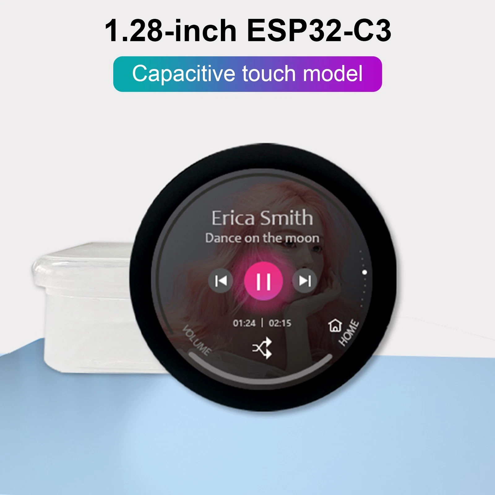
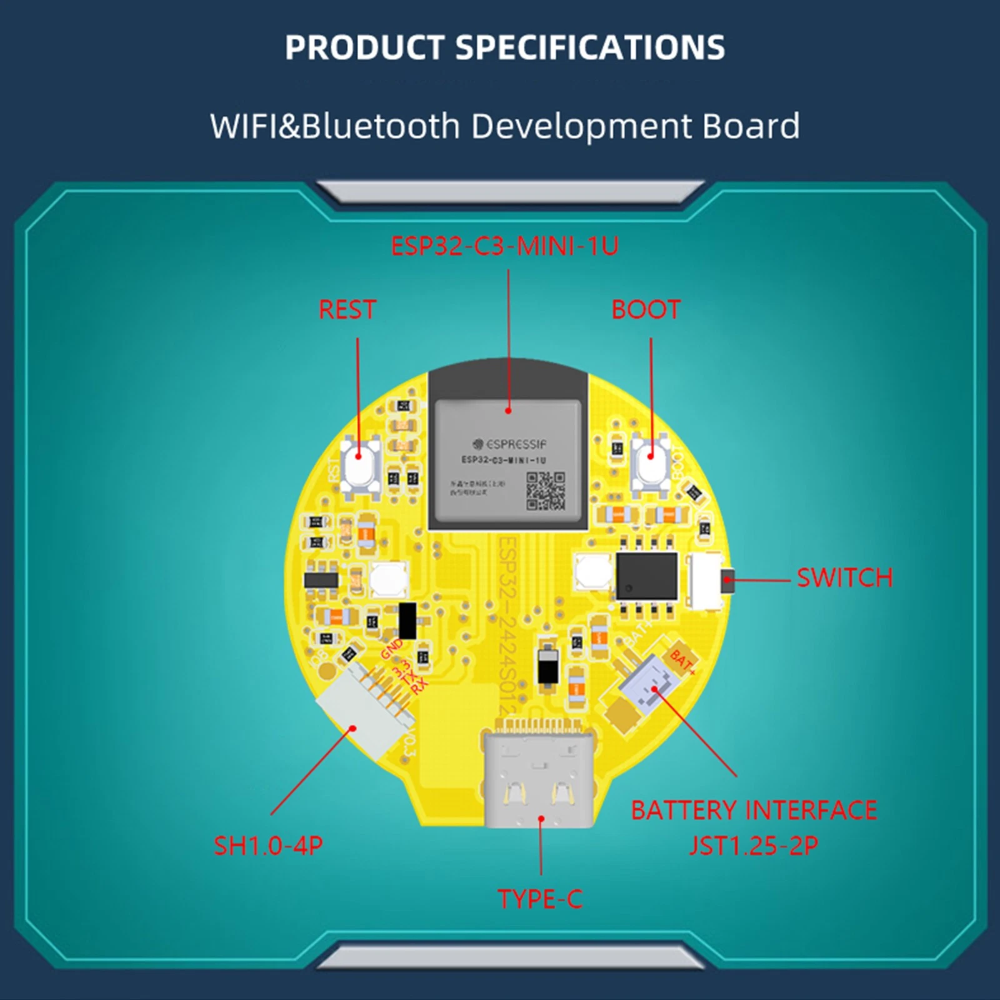
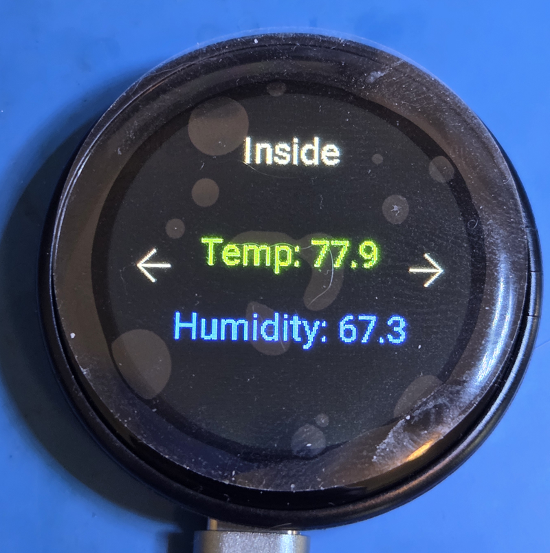

# ESPHome 1.28" Round LCD Remote

A compact, instant‑on remote control built with **ESPHome**, using a generic **1.28‑inch round 240×240 LCD** featuring:

- **ESP32‑C3** MCU  
- **GC9A01A** display driver  
- **CST816** capacitive touchscreen  

This project turns the device into a standalone, low‑power, always‑ready controller for a camper/RV environment using **ESP‑NOW** for communication—no Wi‑Fi or Home Assistant required.

---

## Hardware Overview

### Front  

### Rear  

These inexpensive round displays are widely available and include everything needed for a self‑contained remote: CPU, display, and touch controller.

---

## Project Goals

The remote is designed for **fast, reliable control** inside a camper without depending on a phone, Wi‑Fi, or Home Assistant. Key goals include:

- Instant‑on operation  
- USB‑C power  
- Simple page‑based UI with left/right navigation  
- Touch‑based controls for fan and lighting  
- Clear navigation arrows on screen  
- ESP‑NOW communication (encrypted)  
- Optional local web server for debugging  (not really needed, so it was removed, but its easy to re-add)
- Optional Home Assistant integration for monitoring  

### Planned Pages
#### First Screen

1. **Environment Page**  
   Displays interior temperature and humidity.  
   *No controls on this page.*

3. **Fan Control Page**  
   Shows current fan speed.  
   Up/down touch regions adjust speed.
   Center tap toggles on/off

5. **Exterior Lighting Page**  
   Shows current brightness.  
   Up/down touch regions adjust brightness.
   Center tap toggles on/off

4. **Mode Page**  
   Shows current camper mode.  
   Center tap rotates mode.

5. **Opening/Security Page**
   Show if doors or windows are open.
   If the mode is secured, or traveling, it may be a good idea to switch to this page and turn on the backlight as an alert. (not implemented yet)
   
---

## Background and Development Notes

I’ve owned these round LCD modules for a while but struggled to get them working reliably—mostly due to driver inconsistencies and outdated examples. With recent ESPHome updates, the **mipi_spi** display component now works well with the GC9A01A, and the CST816 touchscreen is supported.

Earlier attempts using LVGL were unstable or overly complex for this use case. The current approach uses:

- `mipi_spi` for the display  
- `touchscreen` component for CST816  
- `ESP‑NOW` for communication  
- ESPHome **display pages** for a clean UI structure  

Some code was generated with the help of Copilot/ChatGPT, but required significant cleanup because LLMs tend to mix ESPHome and Arduino patterns. The final result is fully ESPHome‑native. I gained a lot of insight from [Home Assistant Forum Topic](this Home Assistant Thread: https://community.home-assistant.io/t/1-28-inch-240-240-esp32c3-round-display-with-rotary-knob-uedx24240013-md50e-by-viewe-company/786687) 

---

## Current Status

This version implements:

- Two‑way ESP‑NOW updates from the camper’s main controller (sensor data) and commands back (single INTEGER sensor) 
- Multi‑page UI with navigation arrows  
- Touch‑based page switching  
- Fan and light control logic  
- Stable display rendering
- Mode change display
- Optional web server for debugging  (removed with latest update due to memory)

The remote works independently of Home Assistant or Wi‑Fi, which is essential for RV use where networks may not be available. It provides quick access to lighting and fan controls without needing to unlock a phone or load a web UI.

NOTE - I found that my version of the hardware DOES have an internal antenna glued to the rear of the case. However.. we still struggle with short range. The debug dump of mac and RSSI on the espnow on_receive event helps show you how bad the reception is.. and when the ESPNow link is too weak, the system can really act weird.
---

## Related Projects

Companion repositories will be published soon, including:

- The **main camper monitor** ESP32 device  
- An **in‑vehicle monitor** for real‑time status while driving  

These work together with this remote to form a complete monitoring and control system.

---
